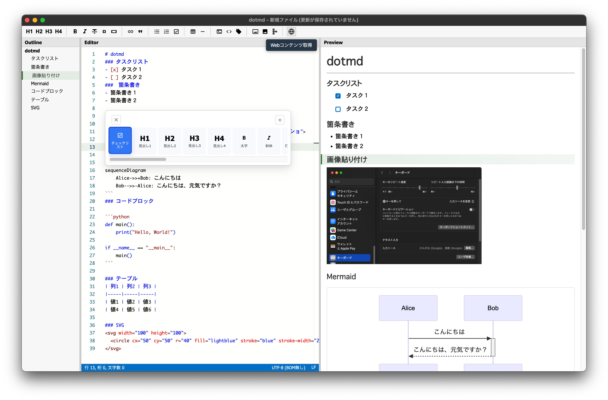

# dotmd
## Markdown Editor

English | [日本語](README.md)

<p align="center">
  
</p>

## Overview
dotmd is a Markdown editor with synchronized three-pane display  
(outline, editor, and preview).
- Real-time preview (edits are reflected instantly)
- Rich Markdown features: Mermaid diagrams, math, code highlighting, and more
- Automatic detection of external file changes
- Multiple-instance support
- Web content fetching
- Visual table editing (with CSV/TSV import)
- draw.io diagram creation and editing

<p align="center">
  
</p>

---
## Key Features

### 📝 Editor Pane
- **Monaco Editor**: the same editor component used in VS Code
- **Markdown syntax helper**: Ctrl+I opens a picker for Markdown syntax
- **Image insertion**: Ctrl+V pastes images (inserted as HTML)
- **File loading**: drag and drop a .md file to open it
- **Collapsible**: click the title bar to hide (or toggle with Ctrl+D)

### 👁️ Preview Pane
- **Real-time preview**: edits are reflected instantly
- **Mermaid diagrams**: flowcharts, sequence diagrams, and more, rendered automatically
- **Code highlighting**: syntax coloring per language via Prism.js
- **Checklist sync**: checking a box in the preview updates the editor
- **Collapsible**: click the title bar to hide (or toggle with Ctrl+M)
- **Image display**: shows inserted images

### 🗂️ Outline Pane
- **Heading list**: automatically extracts Markdown headings
- **Click to jump**: click a heading to jump to that location
- **Collapsible**: click the title bar to hide (or toggle with Ctrl+L)

### 🔤 Encoding and Line Endings
- **Encoding**: Auto / Shift_JIS / UTF-8 (no BOM) / UTF-8 (with BOM)
  - Auto resolves to UTF-8 (no BOM)
- **Line ending**: Auto / CR+LF / LF
  - Auto resolves to CR+LF on Windows, LF on Mac
- **Status bar**: shows the current file's encoding and line ending
- **Menu access**: [File] → [Encoding] / [Line Ending]

### 📥 Web Content Fetching
- **Toolbar button**: click the globe icon to open the URL input dialog
- **Content fetching**: fetches the text content of the page at the given URL
- **Separate window**: shows the fetched content in a read-only editor
- **Copy**: use the "Select All and Copy" button to copy to the clipboard

### 📊 Table Editing
- **Visual editing**: click the icon to launch the table editor in a separate window
- **Icon widget**: an edit icon appears when the cursor is inside a Markdown table
- **CSV/TSV import**: load table data from a file

### 🎨 Diagram Creation and Editing
- **Toolbar button**: click the diagram icon to launch the draw.io editor
- **Diagram creation**: create flowcharts, UML diagrams, network diagrams, and more
- **Auto-save**: saves as `.drawio.svg` and inserts a reference into the Markdown
- **Re-editing**: double-click a diagram in the preview to reopen the editor

### 🌐 Optional Features (require setup)

#### DeepL Translation (Ctrl+T)
- Select text and press Ctrl+T to translate between Japanese and English
- In the editor, the translation replaces the selected text
- In the preview, the translation is shown read-only
- **Setup**: set your API key in config.json's `deepl` section

#### Tavily Web Search (Ctrl+Q)
- Select text and press Ctrl+Q to show web search results
- Click a result's URL to open it in your browser
- **Setup**: set your API key in config.json's `tavily` section

---
## Supported Platforms

| Platform | Status | Distribution |
|----------|--------|---------------|
| **Windows 10/11** | ✅ | Installer / Portable |
| **macOS (Apple Silicon)** | ✅ | DMG package |

### Windows

#### Installer (recommended)
- **File name**: `dotmd_{version}_windows_Setup.exe`
- **Details**:
  - NSIS installer format
  - Creates Desktop / Start Menu shortcuts
  - Config file (config.json) location: `C:\Users\{user}\AppData\Roaming\dotmd\`
  - Supports automatic updates

#### Portable
- **File name**: `dotmd_{version}_windows_portable.zip`
- **Details**:
  - No installation needed - just unzip and run
  - Config file lives next to the executable
  - No automatic updates

### macOS

- **File name**: `dotmd_{version}_macos_arm64.dmg`
- **Supported CPU**: Apple Silicon (M1 / M2 / M3 / M4)
- **Details**:
  - DMG installer
  - Config file (config.json) location: `~/Library/Application Support/dotmd/`
  - Install by dragging into the Applications folder

  **Note**: Intel Macs are not supported.

---
## Basic Usage

### Opening a file
- **From the menu**: [File] → [Open File]
- **Drag and drop**: drop a .md file onto the editor
- **Double-click**: after associating .md files with dotmd, double-click to launch
- **Recent files**: [File] → [Recent Files]

### Saving a file
- **Save**: Ctrl+S (menu: [File] → [Save])
- **Save As**: [File] → [Save As]

### Entering Markdown syntax
1. Press Ctrl+I to open the syntax picker
2. Click the icon for the syntax you want

### Inserting images
1. Copy an image to the clipboard
2. Press Ctrl+V in the editor -
   it's inserted as an HTML `` tag (size and alignment are editable)

### Fetching web content
1. Click the globe icon (🌐) in the toolbar
2. Enter a URL in the dialog (e.g. https://example.com)
3. Click "Fetch"
4. The fetched content appears in a separate window
5. Use "Select All and Copy" to copy it to the clipboard

### Editing a table
1. Place the cursor inside a Markdown table
2. Click the edit icon (📋) that appears above/below the table
3. Edit it in the table editor's separate window
   - Click a cell to enter or change its value
   - Add/remove rows and columns, change alignment
   - "Import from File" lets you load a CSV/TSV file
4. Click "Done" to apply the changes back to the editor

### Creating and editing diagrams
1. Click the diagram icon in the toolbar
2. The draw.io editor opens in a separate window
3. Save it as a `.drawio.svg` file
   - A reference to the diagram is inserted into the editor
   - It's rendered in the preview
4. Click the widget in the editor to reopen and re-edit an existing diagram

### Toggling panels
- **Outline**: Ctrl+L (or click the title bar)
- **Editor**: Ctrl+D (or click the title bar)
- **Preview**: Ctrl+M (or click the title bar)

---
## Keyboard Shortcuts

### File operations
- `Ctrl+N` - New File
- `Ctrl+O` - Open File
- `Ctrl+S` - Save
- `Ctrl+W` - Close File

### Editing
- `Ctrl+I` - Show the Markdown syntax picker
- `Ctrl+V` - Paste image (when the clipboard has an image)
- `Ctrl+F` - Find
- `Ctrl+H` - Replace
- `F3` - Find Next
- `Shift+F3` - Find Previous

### Panels
- `Ctrl+L` - Toggle the Outline panel
- `Ctrl+D` - Toggle the Editor panel
- `Ctrl+M` - Toggle the Preview panel

### Optional features (require setup)
- `Ctrl+T` - DeepL translation (translates the selected text)
- `Ctrl+Q` - Tavily web search (searches with the selected text)

The full shortcut list is available from the app's menu at [Help] → [Keyboard Shortcuts].

---
## Configuration File

### config.json (created automatically)

Created automatically on first launch. Restart the app after changing settings.

**Location**:
- **Windows installer build**:
    - config.json location: `C:\Users\{user}\AppData\Roaming\dotmd\`
- **Windows portable build**: same folder as the executable
- **macOS**: inside the application package
  - config.json location: `~/Library/Application Support/dotmd/`

**Key settings**:
```json
{
  "encoding": "UTF-8(BOM無し)",
  "lineEnding": "CR+LF",
  "fonts": {
    "editor": {
      "fontFamily": "'Consolas', monospace",
      "fontSize": "13"
    },
    "preview": {
      "fontFamily": "'Consolas', monospace",
      "fontSize": "13"
    }
  },
  "deepl": {
    "useDeepL": false,
    "apiKey": "",
    "apiUrl": "https://api-free.deepl.com"
  },
  "tavily": {
    "useTavily": false,
    "apiKey": "",
    "apiUrl": "https://api.tavily.com",
    "maxResults": 10,
    "searchDepth": "advanced"
  },
  "proxy": {
    "useProxy": false,
    "httpProxy": "",
    "httpsProxy": ""
  }
}
```

---
## Setting Up Optional Features

### DeepL Translation

1. Create an account at [DeepL API](https://www.deepl.com/pro-api)
2. Get an API key (a free plan is available)
3. Edit config.json:
   ```json
   "deepl": {
     "useDeepL": true,
     "apiKey": "YOUR_DEEPL_API_KEY",
     "apiUrl": "https://api-free.deepl.com"
   }
   ```
4. Restart the app
5. Select text and press Ctrl+T to translate

### Tavily Web Search

1. Create an account at [Tavily](https://tavily.com/)
2. Get an API key (a free plan is available)
3. Edit config.json:
   ```json
   "tavily": {
     "useTavily": true,
     "apiKey": "YOUR_TAVILY_API_KEY",
     "apiUrl": "https://api.tavily.com",
     "maxResults": 10,
     "searchDepth": "advanced"
   }
   ```
4. Restart the app
5. Select text and press Ctrl+Q to search

---
## Proxy Settings

If you need a proxy (e.g. on a corporate network), configure it in config.json:

```json
"proxy": {
  "useProxy": true,
  "httpProxy": "http://proxy.example.com:8080",
  "httpsProxy": "https://proxy.example.com:8080"
}
```

**Note**: proxy behavior varies by environment and isn't guaranteed to work everywhere.

---
## FAQ

### Q: Does it run on Intel Macs?
A: No. Only Apple Silicon (M1/M2/M3/M4) is supported.

### Q: Can I use it offline?
A: Yes - the core features (editing, preview, saving) work offline. DeepL translation, Tavily search, web content fetching, and the draw.io diagram editor all require an internet connection.

### Q: What does web content fetching actually retrieve?
A: It extracts the body text of the page, with `<script>` and `<style>` tags removed. Images, video, and other media are not fetched.

### Q: What format are tables saved in?
A: Standard Markdown table syntax. Tables imported from CSV/TSV are automatically converted to Markdown tables on insertion.

### Q: Can draw.io diagrams be edited offline?
A: Creating and editing a diagram requires draw.io's online editor (https://embed.diagrams.net/), so an internet connection is needed for that. Once a `.drawio.svg` file has been created, though, it can still be viewed in the preview offline.

---
## Privacy and Security

dotmd is designed with **user privacy and security as the top priority**.

### Data handling

- **No unauthorized data collection**
  - There is no functionality that collects your personal information, editing content, or usage data
  - There is no telemetry or automatic error reporting

- **No unauthorized outbound communication**
  - The only data the app sends externally is:
    - **Web content fetching**: requests to the URL you enter (only when you use that toolbar feature)
    - **DeepL API**: the text you're translating (only if DeepL is enabled)
    - **Tavily API**: your search query (only if Tavily is enabled)
    - **draw.io editor**: diagram data (communicates with https://embed.diagrams.net/ while creating/editing a diagram)

- **All data is stored locally**
  - Your files, settings, and history are all stored **on your own computer**
  - Nothing is uploaded to a third-party server

### Handling of API keys

- DeepL and Tavily API keys are stored only in your **local config file** (config.json)
- These credentials are never sent anywhere else
- **Do not share your config.json with anyone**

### Verifying safety yourself

1. **Run a virus scan**
   - Always scan the download before running it
   - Use Windows Defender, or a security product of your choice

2. **Firewall / network monitoring**
   - You can use your firewall or a network monitor to verify what the app communicates with
   - With the optional features disabled, the app makes **no outbound network connections at all**

**Important**: this application respects your privacy and only makes the minimum necessary API calls when you explicitly enable an optional feature. All data is managed on your own computer. Always run a virus scan after downloading.

---
## Support / Feedback

- **Issues**: [GitHub Issues](https://github.com/Ore2Mon2/dotmd/issues)

---
## License

- Copyright to dotmd is owned by the developer (Ore2Mon2). You may not copy, modify, reverse engineer, decompile, disassemble, redistribute, rent, lease, or resell this software without the copyright holder's permission.
- Third-party open-source libraries used internally remain subject to their own respective licenses. See [THIRD-PARTY-LICENSES.md](THIRD-PARTY-LICENSES.md) for details.
- See [LICENSE.md](LICENSE.md) for the full license text.

---
## Disclaimer

This software is provided **"AS IS"**, without warranty of any kind, express or implied.

### Limitation of liability

The developer is not liable for any damages arising from the use of this software, including but not limited to:

- **Data loss or corruption** (lost files, lost edits, etc.)
- **External API usage charges** (DeepL API, Tavily API fees)
- **Security incidents** (leaked API keys, unauthorized access, etc.)
- **System failures or malfunctions**
- **Any other direct, indirect, incidental, special, punitive, or consequential damages**

### Usage notes

- Keep your API keys (DeepL, Tavily) secure
- Do not share your config.json file with anyone
- External API usage is billed per use - check your usage periodically
- We recommend backing up important files regularly

**Use of this software is entirely at your own risk.**

---
## 📋 Version History

[GitHub Releases](https://github.com/Ore2Mon2/dotmd/releases)
