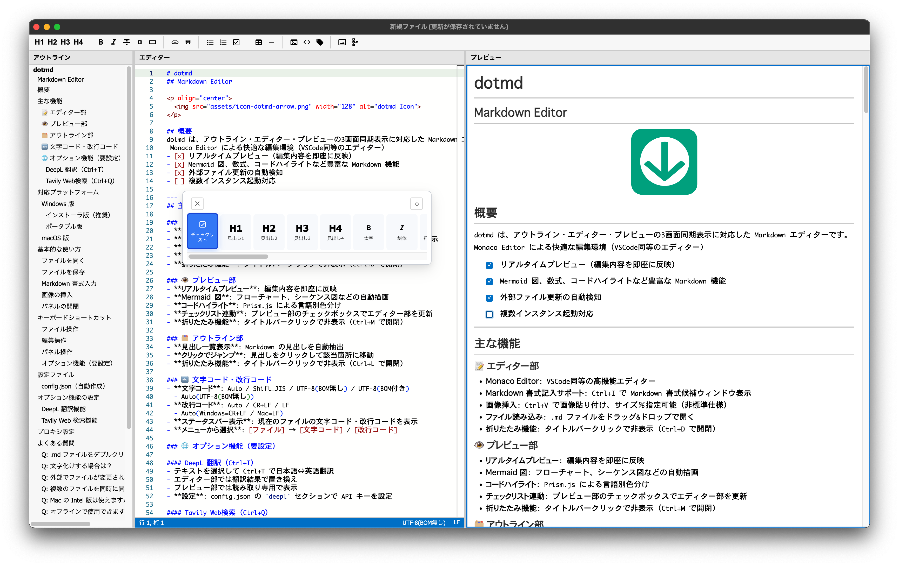

# dotmd
## Markdown Editor

<p align="center">
  
</p>

## 概要
dotmd は、アウトライン・エディター・プレビューの3画面同期表示に対応した  
Markdown エディターです。
- リアルタイムプレビュー（編集内容を即座に反映）
- Mermaid 図、数式、コードハイライトなど豊富な Markdown 機能
- 外部ファイル更新の自動検知
- 複数インスタンス起動対応
- Webコンテンツ取得機能

<p align="center">
  
</p>

---
## 主な機能

### 📝 エディター部
- **Monaco Editor**: VSCode内蔵のエディターと同等のコンポーネント使用
- **Markdown 書式記入サポート**: Ctrl+I で Markdown 書式候補ウィンドウ表示
- **画像挿入**: Ctrl+V で画像貼り付け、サイズ％指定可能（非標準仕様）
- **ファイル読み込み**: .md ファイルをドラッグ&ドロップで開く
- **折りたたみ機能**: タイトルバークリックで非表示（Ctrl+D で開閉）

### 👁️ プレビュー部
- **リアルタイムプレビュー**: 編集内容を即座に反映
- **Mermaid 図**: フローチャート、シーケンス図などの自動描画
- **コードハイライト**: Prism.js による言語別色分け
- **チェックリスト連動**: プレビュー部のチェックボックスでエディター部を更新
- **折りたたみ機能**: タイトルバークリックで非表示（Ctrl+M で開閉）

### 🗂️ アウトライン部
- **見出し一覧表示**: Markdown の見出しを自動抽出
- **クリックでジャンプ**: 見出しをクリックして該当箇所に移動
- **折りたたみ機能**: タイトルバークリックで非表示（Ctrl+L で開閉）

### 🔤 文字コード・改行コード
- **文字コード**: Auto / Shift_JIS / UTF-8(BOM無し) / UTF-8(BOM付き)
  - Auto(UTF-8(BOM無し))
- **改行コード**: Auto / CR+LF / LF
  - Auto(Windows=CR+LF / Mac=LF)
- **ステータスバー表示**: 現在のファイルの文字コード・改行コードを表示
- **メニューから選択**: [ファイル] → [文字コード] / [改行コード]

### 📥 Webコンテンツ取得
- **ツールバーボタン**: 地球儀アイコンをクリックして URL 入力ダイアログを表示
- **コンテンツ取得**: 入力した URL の Web ページからテキストコンテンツを取得
- **別ウィンドウ表示**: 取得したコンテンツを読み取り専用のエディターで表示
- **コピー機能**: 「全て選択しコピー」ボタンでクリップボードにコピー

### 🌐 オプション機能（要設定）

#### DeepL 翻訳（Ctrl+T）
- テキストを選択して Ctrl+T で日本語⇔英語翻訳
- エディター部では翻訳結果で置き換え
- プレビュー部では読み取り専用で表示
- **設定**: config.json の `deepl` セクションで API キーを設定

#### Tavily Web検索（Ctrl+Q）
- テキストを選択して Ctrl+Q で Web 検索結果を表示
- 検索結果の URL をクリックしてブラウザで開く
- **設定**: config.json の `tavily` セクションで API キーを設定

---
## 対応プラットフォーム

| プラットフォーム | 対応状況 | 配布形式 |
|----------------|---------|---------|
| **Windows 10/11** | ✅ | インストーラ版 / ポータブル版 |
| **macOS (Apple Silicon)** | ✅ | DMG パッケージ |

### Windows 版

#### インストーラ版（推奨）
- **ファイル名**: `dotmd_{バージョン番号}_windows_Setup.exe`
- **特徴**:
  - NSIS インストーラ形式
  - デスクトップ・スタートメニューにショートカット作成
  - 設定ファイル(config.json)保存先（`C:\Users\{user}\AppData\Roaming\dotmd\`）  
  - 自動更新機能対応  

#### ポータブル版
- **ファイル名**: `dotmd_{バージョン番号}_windows_portable.zip`
- **特徴**:
  - インストール不要、解凍して使用可能
  - 実行ファイルと同じフォルダに設定ファイル
  - 自動更新機能なし  

### macOS 版

- **ファイル名**: `dotmd_{バージョン番号}_macos_arm64.dmg`
- **対応 CPU**: Apple Silicon (M1 / M2 / M3 / M4)
- **特徴**:
  - DMG 形式のインストーラ
  - 設定ファイル(config.json)保存先: `~/Library/Application Support/dotmd/`  
  - アプリケーションフォルダにドラッグ&ドロップでインストール

  **注意1**: Intel Mac には対応していません。
  **注意2**: 初回起動時に「"dotmd.app" は壊れているため開けません」というエラーが表示されます。
  #### エラーの対処方法
  このアプリは Apple の公証（notarization）を取得していないため、macOS Gatekeeper により初回起動時にブロックされます。
  エラーが表示されたら一旦キャンセルし、以下の方法を実施することで起動できます：
  **ターミナルで quarantine 属性を削除**
```Terminal
xattr -d com.apple.quarantine /Applications/dotmd.app
```  

- 一度上記の方法で許可すれば、以降は通常通りダブルクリックで起動できますが、  
バージョンアップ版インストール後の初回起動時も上記コマンドを実行する必用があります。

---
## 基本的な使い方

### ファイルを開く
- **メニューから**: [ファイル] → [開く]
- **ドラッグ&ドロップ**: .md ファイルをエディター部にドロップ
- **ダブルクリック**: .md ファイルに関連付け後、ダブルクリックで起動
- **最近開いたファイル**: [ファイル] → [最近開いたファイル]

### ファイルを保存
- **上書き保存**: Ctrl+S（メニュー: [ファイル] → [保存]）
- **名前を付けて保存**: [ファイル] → [名前を付けて保存]

### Markdown 書式入力
1. Ctrl+I で書式候補ウィンドウを表示
2. 使いたい書式アイコンをクリック

### 画像の挿入
1. クリップボードに画像をコピー
2. エディター部で Ctrl+V  
   パーセント指定で画像サイズを調整できます。(非標準機能)

### Webコンテンツの取得
1. ツールバーの地球儀アイコン（🌐）をクリック
2. ダイアログに URL を入力（例: https://example.com）
3. 「実行」ボタンをクリック
4. 別ウィンドウで取得したコンテンツが表示されます
5. 「全て選択しコピー」ボタンでクリップボードにコピー

### パネルの開閉
- **アウトライン部**: Ctrl+L（またはタイトルバークリック）
- **エディター部**: Ctrl+D（またはタイトルバークリック）
- **プレビュー部**: Ctrl+M（またはタイトルバークリック）

---
## キーボードショートカット

### ファイル操作
- `Ctrl+N` - 新規ファイル
- `Ctrl+O` - ファイルを開く
- `Ctrl+S` - 保存
- `Ctrl+W` - ファイルを閉じる

### 編集操作
- `Ctrl+I` - Markdown 書式候補ウィンドウ表示
- `Ctrl+V` - 画像貼り付け（クリップボードに画像がある場合）
- `Ctrl+F` - 検索
- `Ctrl+H` - 置換
- `F3` - 次を検索
- `Shift+F3` - 前を検索

### パネル操作
- `Ctrl+L` - アウトライン部の開閉
- `Ctrl+D` - エディター部の開閉
- `Ctrl+M` - プレビュー部の開閉

### オプション機能（要設定）
- `Ctrl+T` - DeepL 翻訳（選択テキストを翻訳）
- `Ctrl+Q` - Tavily Web 検索（選択テキストで検索）

完全なショートカット一覧は、アプリのメニュー [ヘルプ] → [ショートカット一覧] で確認できます。

---
## 設定ファイル

### config.json（自動作成）

初回起動時に自動的に作成されます。設定を変更したらアプリを再起動して下さい。

**保存場所**:
- **Windows インストーラ版**: 
    - 設定ファイル(config.json)保存先（`C:\Users\{user}\AppData\Roaming\dotmd\`）  
- **Windows ポータブル版**: 実行ファイルと同じフォルダ
- **macOS**: アプリケーションパッケージ内
  - 設定ファイル(config.json)保存先: `~/Library/Application Support/dotmd/`)

**主な設定項目**:
```json
{
  "encoding": "UTF-8(BOM無し)",
  "lineEnding": "CR+LF",
  "fonts": {
    "editor": {
      "fontFamily": "'Consolas', monospace",
      "fontSize": "13"
    },
    "preview": {
      "fontFamily": "'Consolas', monospace",
      "fontSize": "13"
    }
  },
  "deepl": {
    "useDeepL": false,
    "apiKey": "",
    "apiUrl": "https://api-free.deepl.com"
  },
  "tavily": {
    "useTavily": false,
    "apiKey": "",
    "apiUrl": "https://api.tavily.com",
    "maxResults": 10,
    "searchDepth": "advanced"
  },
  "proxy": {
    "useProxy": false,
    "httpProxy": "",
    "httpsProxy": ""
  }
}
```

---
## オプション機能の設定

### DeepL 翻訳機能

1. [DeepL API](https://www.deepl.com/pro-api) でアカウントを作成
2. API キーを取得（無料プランあり）
3. config.json を編集:
   ```json
   "deepl": {
     "useDeepL": true,
     "apiKey": "YOUR_DEEPL_API_KEY",
     "apiUrl": "https://api-free.deepl.com"
   }
   ```
4. アプリを再起動
5. テキストを選択して Ctrl+T で翻訳

### Tavily Web 検索機能

1. [Tavily](https://tavily.com/) でアカウントを作成
2. API キーを取得（無料プランあり）
3. config.json を編集:
   ```json
   "tavily": {
     "useTavily": true,
     "apiKey": "YOUR_TAVILY_API_KEY",
     "apiUrl": "https://api.tavily.com",
     "maxResults": 10,
     "searchDepth": "advanced"
   }
   ```
4. アプリを再起動
5. テキストを選択して Ctrl+Q で検索

---
## プロキシ設定

企業ネットワーク環境などでプロキシが必要な場合、config.json で設定できます：

```json
"proxy": {
  "useProxy": true,
  "httpProxy": "http://proxy.example.com:8080",
  "httpsProxy": "https://proxy.example.com:8080"
}
```

**注意**: プロキシ設定は環境ごとに異なるため、動作保証はできません。

---
## よくある質問

### Q: Mac の Intel 版は使えますか？
A: Intel Mac には対応していません。Apple Silicon (M1/M2/M3/M4) 専用です。

### Q: オフラインで使用できますか？
A: はい、基本機能（編集、プレビュー、保存）はオフラインで使用できます。DeepL 翻訳、Tavily 検索、AI チャット機能、Webコンテンツ取得機能はインターネット接続が必要です。

### Q: Webコンテンツ取得で取得できる内容は？
A: Web ページの本文テキストを取得します。HTML から script タグや style タグを除外し、body 部分のテキストコンテンツを抽出します。画像や動画などのメディアファイルは取得されません。

---
## プライバシー・セキュリティ

dotmd は**ユーザーのプライバシーとセキュリティを最優先**に設計されています。

### データの取り扱い

- **不正な情報収集は一切行いません**
  - ユーザーの個人情報、編集内容、使用状況などのデータを収集する機能は実装されていません
  - 使用状況の自動送信、エラーレポート送信などの機能も一切含まれていません

- **不正な外部送信は一切行いません**
  - アプリケーションが外部に送信するデータは以下の機能のみです：
    - **Webコンテンツ取得**: 入力した URL へのアクセス（ツールバーボタンから使用した場合のみ）
    - **DeepL API**: 翻訳テキスト（DeepL 機能を有効化した場合のみ）
    - **Tavily API**: 検索クエリ（Tavily 機能を有効化した場合のみ）

- **すべてのデータはローカルに保存されます**
  - ファイル、設定、履歴はすべて**お使いのコンピュータ内**に保存されます
  - データは第三者のサーバーにアップロードされることはありません

### API キーの取り扱い

- DeepL API キー、Tavily API キーの認証情報は**ローカルの設定ファイル**（config.json）にのみ保存されます
- これらの認証情報を外部に送信することはありません
- **config.json を第三者と共有しないでください**

### 安全性の確認方法

1. **ウイルスチェックの実施**
   - ダウンロード後は必ずウイルスチェックを実施してください
   - Windows Defender、ウイルスバスター、ノートンなどのセキュリティソフトでスキャンしてからご使用ください

2. **ファイアウォール/ネットワークモニタリング**
   - お使いのファイアウォールやネットワーク監視ツールで、アプリケーションの通信先を確認できます
   - オプション機能を無効化している場合、外部への通信は**一切発生しません**

**重要**: このアプリケーションは、ユーザーのプライバシーを尊重し、オプション機能を有効化した場合のみ必要最低限の API 通信を行います。すべてのデータはユーザーのコンピュータ内で管理されます。ダウンロード後は必ずウイルスチェックを実施してください。

---
## サポート・フィードバック

- **Issues**: [GitHub Issues](https://github.com/Ore2Mon2/dotmd/issues)

---
## ライセンス

- このソフトウェアは MIT ライセンスの下で配布されています。詳細は [LICENSE.md](LICENSE.md) をご覧ください。
- サードパーティライブラリのライセンス情報は [THIRD-PARTY-LICENSES.md](THIRD-PARTY-LICENSES.md) をご覧ください。

---
## 免責事項

このソフトウェアは**「現状のまま」（AS IS）**で提供されます。開発者は、明示的または黙示的を問わず、いかなる保証も行いません。

### 責任の制限

本ソフトウェアの使用により生じた、以下を含むがこれに限定されない、いかなる損害についても、開発者は一切の責任を負いません：

- **データの損失または破損**（ファイルの消失、編集内容の喪失など）
- **外部 API 使用料金の発生**（DeepL API、Tavily API の使用料金）
- **セキュリティインシデント**（API キーの漏洩、不正アクセスなど）
- **システムの障害または誤動作**
- **その他、直接的・間接的・付随的・特別・懲罰的・派生的な損害**

### 使用上の注意

- API キー（DeepL、Tavily）は厳重に管理してください
- config.json ファイルを第三者と共有しないでください
- 外部 API の使用料金は従量課金です。使用状況を定期的に確認することを推奨します
- 重要なファイルは定期的にバックアップを取ることを推奨します

**本ソフトウェアの使用は、すべてユーザーの自己責任において行われるものとします。**

---
## 📋 バージョン履歴

[GitHub Releases](https://github.com/Ore2Mon2/dotmd/releases)
